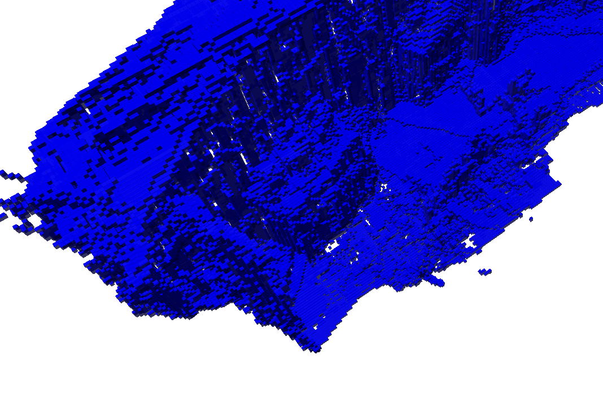
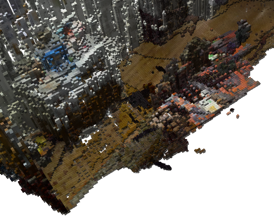

# Extracting a Colored OctoMap

This example was developed using the custom node set up in [Running a Custom Node](./Running%20a%20Custom%20Node.md). As such, verify if the necessary tools are correctly configured in the environment before proceeding. If not, set them up following the guide.

## Difference between .bt and .ot file formats
A previous example has shown [how to save an OctoMap to a file](./Saving%20an%20OctoMap%20to%20a%20File.md) using only OctoMap ROS 2 packages. This solution is viable for the vanilla solution. In this case, a custom node was developed to extend octomap nodes to include RGB color data. While the previous approach to visualize octomaps using Octovis is still viable, the `.bt` (**Binary Terrain**) file format doesn't support RGB color data. For this reason, we must use the `.ot` (**OcTree**) format to store the data obtained from the `.txt` file written by the `ColoredOctomapNode`. 

To abstract the efforts of converting octomaps between formats, two C++ scripts were created:
+ **`make_bt.cpp`:** Converts colored octomaps from `.txt` to `.bt` format.
+ **`make_ot.cpp`:** Converts colored octomaps from `.txt` to `.ot` format.

The difference between the former (blue) format and the latter (colored, RGB) can be observed below.
<div style="display: flex;">
  
  <div style="width: 0.5vw;"></div>
  
</div>

## Map conversion

If the utility scripts are not yet available, copy them to any directory in the container and compile them. These steps are also valid for updating them. In the host, run:
```bash
cd ../tfm17-utils
docker cp ./make_ot.cpp tfm17-mapper:/path/to/utils 
```

[Attach a terminal](./Attaching%20Terminals%20and%20Editors%20to%20the%20Development%20Environment.md) to the `tfm17-mapper` container. Change into your preferred directory to keep the utility scripts and continue:
```bash
cd /path/to/utils
g++ -std=c++11 -o make_ot make_ot.cpp -loctomap -loctomath
./make_ot /path/to/colored_octomap.txt /path/to/colored_octomap.ot 0.025
octovis colored_octomap.ot
```

As a result, assuming the `.txt` file has color data, a colored octomap will be displayed on screen.
