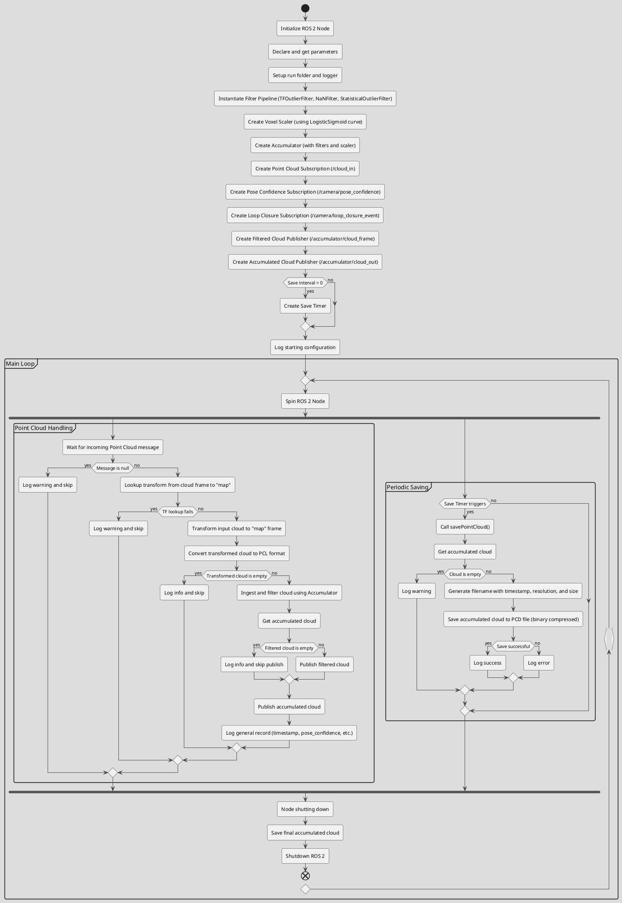
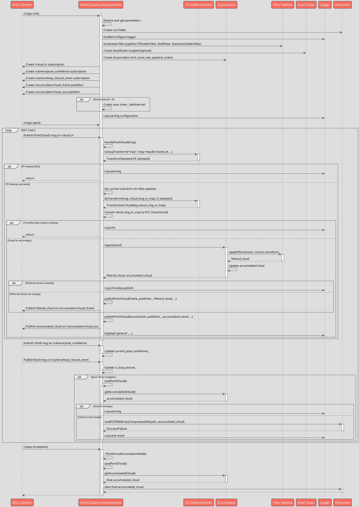

```plantuml
@startuml
!theme toy

start

:Initialize ROS 2 Node;
:Declare and get parameters;
:Setup run folder and logger;
:Instantiate Filter Pipeline (TFOutlierFilter, NaNFilter, StatisticalOutlierFilter);
:Create Voxel Scaler (using LogisticSigmoid curve);
:Create Accumulator (with filters and scaler);
:Create Point Cloud Subscription (/cloud_in);
:Create Pose Confidence Subscription (/camera/pose_confidence);
:Create Loop Closure Subscription (/camera/loop_closure_event);
:Create Filtered Cloud Publisher (/accumulator/cloud_frame);
:Create Accumulated Cloud Publisher (/accumulator/cloud_out);

if (Save interval > 0) then (yes)
  :Create Save Timer;
else (no)
endif

:Log starting configuration;

partition "Main Loop" {
  repeat
    :Spin ROS 2 Node;

    fork
      partition "Point Cloud Handling" {
        :Wait for incoming Point Cloud message;
        if (Message is null) then (yes)
          :Log warning and skip;
        else (no)
          :Lookup transform from cloud frame to "map";
          if (TF lookup fails) then (yes)
            :Log warning and skip;
          else (no)
            :Transform input cloud to "map" frame;
            :Convert transformed cloud to PCL format;
            if (Transformed cloud is empty) then (yes)
              :Log info and skip;
            else (no)
              :Ingest and filter cloud using Accumulator;
              :Get accumulated cloud;
              if (Filtered cloud is empty) then (yes)
                :Log info and skip publish;
              else (no)
                :Publish filtered cloud;
              endif
              :Publish accumulated cloud;
              :Log general record (timestamp, pose_confidence, etc.);
            endif
          endif
        endif
      }
    fork again
      partition "Periodic Saving" {
        if (Save Timer triggers) then (yes)
          :Call savePointCloud();
          :Get accumulated cloud;
          if (Cloud is empty) then (yes)
            :Log warning;
          else (no)
            :Generate filename with timestamp, resolution, and size;
            :Save accumulated cloud to PCD file (binary compressed);
            if (Save successful) then (yes)
              :Log success;
            else (no)
              :Log error;
            endif
          endif
        else (no)
        endif
      }
    end fork
  backward:
}

:Node shutting down;
:Save final accumulated cloud;
:Shutdown ROS 2;

end
@enduml
```

```plantuml
@startuml
!theme toy

participant "ROS 2 System" as ROS
participant "PointCloudAccumulatorNode" as Node
participant "TF2 Buffer/Listener" as TF
participant "Accumulator" as Accum
participant "Filter Pipeline" as Filters
participant "Voxel Scaler" as Voxel
participant "Logger" as Log
participant "Filesystem" as FS

ROS -> Node: rclcpp::init()
activate Node
Node -> Node: Declare and get parameters
Node -> FS: Create run folder
Node -> Log: Enable/Configure logger
Node -> Filters: Instantiate filter pipeline (TFOutlierFilter, NaNFilter, StatisticalOutlierFilter)
Node -> Voxel: Create VoxelScaler (LogisticSigmoid)
Node -> Accum: Create Accumulator (min_voxel_size, pipeline, scaler)
Node -> ROS: Create /cloud_in subscription
Node -> ROS: Create /camera/pose_confidence subscription
Node -> ROS: Create /camera/loop_closure_event subscription
Node -> ROS: Create /accumulator/cloud_frame publisher
Node -> ROS: Create /accumulator/cloud_out publisher
alt Save interval > 0
    Node -> Node: Create save_timer_ (setInterval)
end
Node -> Log: Log starting configuration
ROS -> Node: rclcpp::spin()

loop ROS 2 Spin
    ROS -> Node: Publish PointCloud2 msg on /cloud_in
    activate Node
    Node -> Node: handlePointCloud(msg)
    Node -> TF: lookupTransform("map", msg->header.frame_id, ...)
    activate TF
    TF --> Node: TransformStamped (tf_stamped)
    deactivate TF
    alt TF lookup fails
        Node -> Log: Log warning
        Node --> ROS: return
    else TF lookup succeeds
        Node -> Node: Set current transform for filter pipeline
        Node -> TF: doTransform(msg, cloud_msg_in_map, tf_stamped)
        activate TF
        TF --> Node: Transformed CloudMsg (cloud_msg_in_map)
        deactivate TF
        Node -> Node: Convert cloud_msg_in_map to PCL Cloud (cloud)
        alt Transformed cloud is empty
            Node -> Log: Log info
            Node --> ROS: return
        else Cloud is not empty
            Node -> Accum: ingest(cloud)
            activate Accum
            Accum -> Filters: applyFilters(cloud, current_transform)
            activate Filters
            Filters --> Accum: filtered_cloud
            deactivate Filters
            Accum -> Accum: Update accumulated cloud
            Accum --> Node: filtered_cloud, accumulated_cloud
            deactivate Accum
            alt Filtered cloud is empty
                Node -> Log: Log info (skip publish)
            else Filtered cloud not empty
                Node -> Node: publishPointCloud(frame_publisher_, filtered_cloud, ...)
                Node -> ROS: Publish filtered_cloud on /accumulator/cloud_frame
            end
            Node -> Node: publishPointCloud(accumulator_publisher_, accumulated_cloud, ...)
            Node -> ROS: Publish accumulated_cloud on /accumulator/cloud_out
            Node -> Log: logStep("general", ...)
        end
    end
    deactivate Node

    ROS -> Node: Publish UInt8 msg on /camera/pose_confidence
    activate Node
    Node -> Node: Update current_pose_confidence_
    deactivate Node

    ROS -> Node: Publish Bool msg on /camera/loop_closure_event
    activate Node
    Node -> Node: Update is_loop_closure_
    deactivate Node

    alt Save Timer triggers
        Node -> Node: savePointCloud()
        activate Node
        Node -> Accum: getAccumulatedCloud()
        activate Accum
        Accum --> Node: accumulated_cloud
        deactivate Accum
        alt Cloud is empty
            Node -> Log: Log warning
        else Cloud is not empty
            Node -> FS: savePCDFileBinaryCompressed(filepath, accumulated_cloud)
            activate FS
            FS --> Node: Success/Failure
            deactivate FS
            Node -> Log: Log save result
        end
        deactivate Node
    end
end

ROS -> Node: rclcpp::shutdown()
activate Node
Node -> Node: ~PointCloudAccumulatorNode()
Node -> Node: savePointCloud()
Node -> Accum: getAccumulatedCloud()
activate Accum
Accum --> Node: final_accumulated_cloud
deactivate Accum
Node -> FS: Save final accumulated_cloud
activate FS
FS --> Node:
deactivate FS
Node --> ROS:
deactivate Node
@enduml
```
